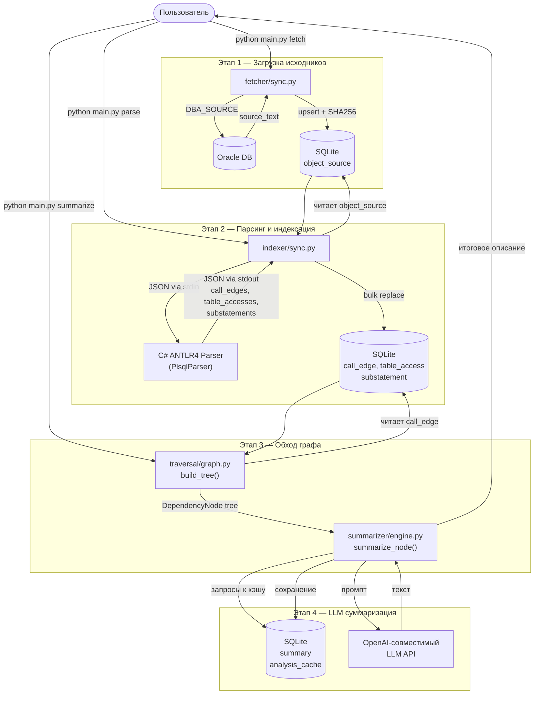
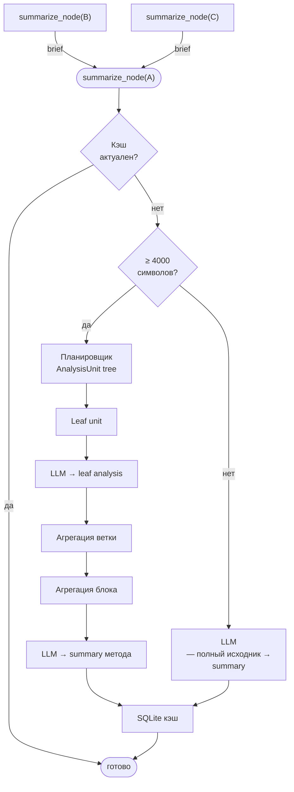

# plsql_explain — Архитектурные схемы

## 1. Общий поток работы

---

## 2. Два измерения анализа — `summarizer/engine.py`

Движок анализирует код сразу в двух измерениях: **вглубь** по иерархии зависимостей и **вширь** по блокам внутри одного объекта.

> **Иерархия** — суммари дочерних объектов (B, C) передаются в промпт родителя (A) как контекст.
> **Substatements** — код объекта раскладывается в дерево `AnalysisUnit`, leaf-фрагменты анализируются отдельно, затем ветки и блоки агрегируются снизу вверх.
